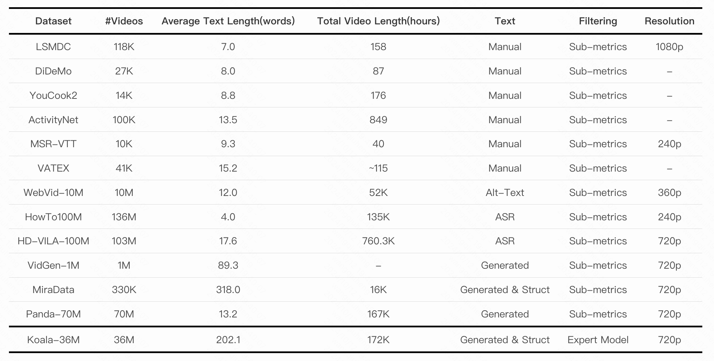
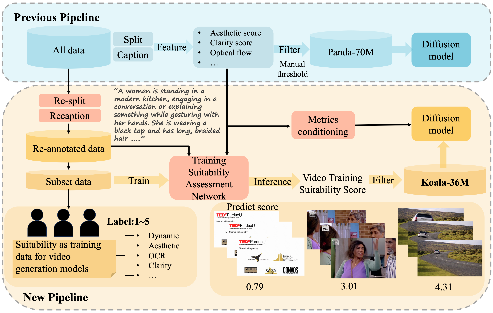
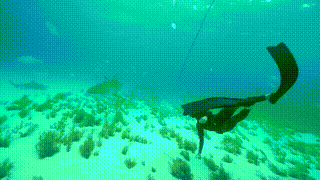
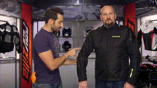
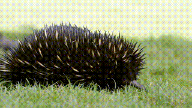
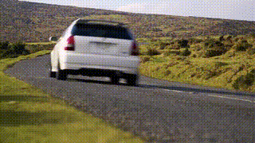
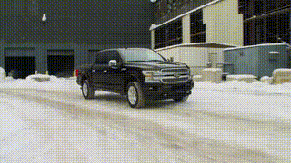

# 🐨 Koala-36M
<div align="center">

## A Large-scale Video Dataset Improving Consistency between Fine-grained Conditions and Video Content


Qiuheng Wang<sup>1,2*</sup>, [Yukai Shi](https://shiyukai26.github.io/info/)<sup>1,3*</sup>, Jiarong Ou<sup>1</sup>, Rui Chen<sup>1</sup>, Ke Lin<sup>1</sup>, Jiahao Wang<sup>1</sup>, Boyuan Jiang<sup>1</sup>, [Haotian Yang](https://yanght321.github.io/)<sup>1</sup>, Mingwu Zheng<sup>1</sup>,<br> [Xin Tao](https://www.xtao.website/)<sup>1</sup>, [Fei Yang](https://yfalan.github.io/)<sup>1†</sup>,  [Pengfei Wan](https://scholar.google.com/citations?hl=zh-CN&user=P6MraaYAAAAJ)<sup>1</sup>, Di Zhang<sup>1</sup> <br>

<sup>1</sup>Kuaishou Technology  <sup>2</sup>Shenzhen University  <sup>3</sup>Tsinghua University   <sup>*</sup>Equal contribution  <sup>†</sup>Corresponding author

[](https://arxiv.org/abs/2410.08260) [](https://koala36m.github.io/) 
[](https://huggingface.co/datasets/Koala-36M/Koala-36M-v1)
</div>

## Introduction
As visual generation technologies continue to advance, the scale of video datasets has expanded rapidly, and the quality of these datasets is critical to the performance of video generation models. We argue that **temporal splitting, detailed captions, and video quality filtering** are three key factors that determine dataset quality. However, existing datasets exhibit various limitations in these areas. To address these challenges, we introduce **Koala-36M**, a large-scale, high-quality video dataset featuring accurate temporal splitting, detailed captions, and superior video quality. The core of our approach lies in **improving the consistency between fine-grained conditions and video content.**

## Dataset

### Comparison of Koala-36M and Panda-70M

We propose a large-scale, high-quality dataset that significantly enhances the consistency between multiple conditions and video content. Koala-36M features more accurate temporal splitting, more detailed captions, and improved video filtering based on the proposed Video Training Suitability Score (VTSS).
<p align="center">
     
</p>

### Comparison of Koala-36M and pervious text-video datasets
Koala-36M is a video dataset that simultaneously possesses a large number of videos (over 10M) and high-quality fine-grained captions (over 200 words). 
<p align="center">
     
</p>

### Compared with previous pipeline
 we propose better **splitting methods, structured caption system, training suitability assessment network and fine-grained conditioning** in red box, improving the consistency between conditions and video content.
<p align="center">
     
</p>

## Demonstration of Koala-36M 

### Video-Caption Pairs 
Koala-36M features more accurate temporal splitting, more detailed captions, and improved video filtering based on the proposed Video Training Suitability Score (VTSS).
  <table class="center">
    <tr>
      <td align="center" width=50% style="border: none"></td>
      <td align="center" width=50% style="border: none"></td>
    </tr>
    <tr style="text-align: center;">
      <td width=50% style="border: none"><small>A scuba diver is exploring a shallow coral reef underwater, observing a large shark swimming nearby. The diver, wearing a black wetsuit and fins, is seen swimming slowly and cautiously through the water, maintaining a safe distance from the shark. The scene is set in a clear, blue underwater environment with sunlight filtering through the water, illuminating the sandy seabed and the surrounding marine life. The shark moves gracefully through the water, its body undulating smoothly as it swims. The diver's movements are deliberate and slow, ensuring they do not disturb the shark. The background remains relatively static, with only minor movements from the smaller fish in the water. The overall movement is slow and steady, with the shark's direction being primarily horizontal across the frame. The main subjects are the scuba diver and the shark. The diver is positioned on the right side of the frame, wearing a black wetsuit and fins, and is seen swimming slowly and cautiously. The shark is on the left side of the frame, swimming in the same direction as the diver but at a greater distance. The shark's body is streamlined, and it moves smoothly through the water. The background consists of a sandy seabed covered with patches of green seaweed and smaller fish. The water is clear, allowing sunlight to penetrate and create a serene underwater atmosphere. The scene is set in a shallow coral reef, with the sandy bottom and marine vegetation providing a natural habitat for the marine life. The camera is stationary, providing a wide-angle view of the scene. The perspective is from the diver's point of view, capturing both the diver and the shark in the frame.<small></td>
      <td width=50% style="border: none"><small>two men in a workshop or garage setting, where one man is demonstrating how to put on a black jacket with the word "KIMM" printed on the back. The man in the black jacket is standing still while the other man, who is wearing a purple shirt, is actively pointing and gesturing to explain the process. The scene is well-lit, and the background includes shelves with various motorcycle helmets and other equipment. The main subjects are two men. The man in the black jacket is wearing a black jacket with the word "KIMM" printed on the back. He is standing still and observing the demonstration. The man in the purple shirt is actively gesturing and explaining the process of putting on the jacket. He is wearing a purple shirt, jeans, and a silver bracelet. The man in the purple shirt is actively pointing and gesturing towards the man in the black jacket, indicating specific areas of the jacket to be adjusted or fastened. His movements are deliberate and focused, with moderate amplitude and speed. The man in the black jacket remains mostly stationary, occasionally shifting his posture slightly to follow the instructions. The background remains static throughout the video. The camera is stationary, providing a medium shot that captures both men and the background clearly. The view is at eye level, focusing on the interaction between the two men.</small></td>
      <tr style="text-align: center;">
      <td width=50% style="border: none"> Clarity Score: 0.9014   Aesthetic score: 5.34    Motion score: 22.03  VTSS: 4.48</td>
      <td width=50% style="border: none">Clarity Score: 0.9964    Aesthetic score: 5.17    Motion score: 0.6632   VTSS: 4.81</td>
    </tr>
  </table>

  <table class="center">
    <tr>
      <td align="center" width=50% style="border: none"></td>
      <td align="center" width=50% style="border: none"></td>
    </tr>
    <tr style="text-align: center;">
      <td width=50% style="border: none"><small>a close-up view of a large, spiky-haired kiwi bird resting on a grassy surface. The bird's feathers are predominantly black with white tips, and it appears to be in a relaxed state, occasionally moving its head and body slightly. The scene is calm and serene, focusing on the bird's detailed features and the texture of its feathers. The background consists of a lush, green grassy area, suggesting a natural outdoor setting. The grass is well-maintained and appears to be healthy, providing a soft and natural backdrop for the bird. There are no other objects or animals visible in the background, keeping the focus on the kiwi bird. The main subject is a kiwi bird, characterized by its large size, black feathers with white tips, and a long, pointed beak. The bird is positioned centrally in the frame, lying on its side with its head slightly raised. Its body is mostly stationary, but it occasionally moves its head and beak, indicating slight movements. The camera is stationary, providing a close-up view of the kiwi bird. The focus remains sharp on the bird throughout the video, with no noticeable camera movement.<small></td>
      <td width=50% style="border: none"><small>A white car is driving along a winding road in a rural area. The car is moving at a moderate speed, navigating the curves of the road. The surrounding landscape is characterized by rolling hills covered in grass and low shrubs. The sky is clear, suggesting a sunny day. The main subject is a white car, which is driving along the road. The car is positioned centrally in the frame, moving from the left to the right side of the screen. The car's movement is smooth and consistent, following the curves of the road. The background consists of a rural landscape with rolling hills covered in grass and low shrubs. The hills are expansive and stretch out to the horizon, creating a sense of depth. The sky is clear, indicating good weather, and the lighting suggests it is daytime. The camera is stationary, capturing a wide-angle view of the road and the surrounding landscape. The perspective is from a slightly elevated angle, providing a clear view of the car's movement and the surrounding environment.<small></td>
     <tr style="text-align: center;">
      <td width=50% style="border: none">Clarity Score: 0.5284.     Aesthetic score: 4.58    Motion score: 50.87   VTSS: 4.35</td>
      <td width=50% style="border: none">Clarity Score: 0.8023.     Aesthetic score: 4.82.   Motion score: 3.94   VTSS: 4.31</td>
  </table>

  <table class="center">
    <tr>
      <td align="center" width=50% style="border: none"></td>
      <td align="center" width=50% style="border: none"></td>
    </tr>
    <tr style="text-align: center;">
      <td width=50% style="border: none"><small>A black Ford F-150 pickup truck is driving down a snowy road in an industrial area. The truck moves steadily forward, its wheels kicking up snow as it progresses. The background features a large, dark building with visible industrial structures and machinery, indicating a cold, snowy environment. The truck's headlights and taillights are on, illuminating the snowy road ahead. The main subject is a black Ford F-150 pickup truck. It has a large, dark grille, silver trim, and black wheels. The truck is positioned centrally in the frame, moving forward. The truck's headlights and taillights are on, and it appears to be in motion, driving down a snowy road. The truck moves steadily forward at a moderate speed, kicking up snow from the road as it progresses. The background remains static, with no visible movement of other objects or changes in the environment. The camera is stationary, capturing the truck's movement from a fixed, slightly elevated angle, providing a clear view of the truck and the snowy road ahead.<small></td>
      <td width=50% style="border: none"><small>a bustling urban scene with a wide view of a city street lined with tall buildings. The street is filled with numerous vehicles, including cars and trucks, moving in both directions. The buildings are a mix of modern and older architectural styles, with some under construction. The scene is set during the day under clear skies, with the sun casting shadows on the buildings and vehicles. The main subjects are the vehicles on the street, including cars and trucks, which are moving in both directions. The vehicles are positioned along the street, with some closer to the camera and others further away. The buildings are prominent structures, with some under construction, and they frame the street. The vehicles are in constant motion, indicating a busy city environment. The background consists of a cityscape with a mix of modern and older buildings. The buildings are tall and varied in design, with some under construction. The street is lined with trees and greenery, adding a touch of nature to the urban setting. The scene is set during the day, with clear skies and bright sunlight casting shadows on the buildings and vehicles. The camera is stationary, providing a wide, aerial view of the city street and buildings. The perspective is from a high vantage point, capturing the entire scene in a single, continuous shot.<small></td>
       <tr style="text-align: center;">
      <td width=50% style="border: none">Clarity Score: 0.9589.     Aesthetic score: 4.93     Motion score: 23.80     VTSS: 4.48</td>
      <td width=50% style="border: none">Clarity Score: 0.9835.     Aesthetic score: 5.08     Motion score: 5.30     VTSS: 4.35</td>
    </tr>
  </table>

## Video Suitability Assessment
we develop a Video Training Suitability Score (VTSS)
that integrates multiple sub-metrics, allowing us to filter high-quality videos from
the original corpus.

To predict the VTSS of the video, you can download the checkpoint from [here](https://huggingface.co/Koala-36M/Training_Suitability_Assessment), then you can run :

```
cd training_suitability_assessment
pip install -e .
python inference.py
```


## License

The video samples are collected from a publicly available dataset.
Users must follow [the related license](https://raw.githubusercontent.com/microsoft/XPretrain/main/hd-vila-100m/LICENSE) to use these video samples.

## Citation

If you find this project useful for your research, please cite our paper.

```
@misc{wang2024koala36mlargescalevideodataset,
      title={Koala-36M: A Large-scale Video Dataset Improving Consistency between Fine-grained Conditions and Video Content}, 
      author={Qiuheng Wang and Yukai Shi and Jiarong Ou and Rui Chen and Ke Lin and Jiahao Wang and Boyuan Jiang and Haotian Yang and Mingwu Zheng and Xin Tao and Fei Yang and Pengfei Wan and Di Zhang},
      year={2024},
      eprint={2410.08260},
      archivePrefix={arXiv},
      primaryClass={cs.CV},
      url={https://arxiv.org/abs/2410.08260}, 
    }
```
